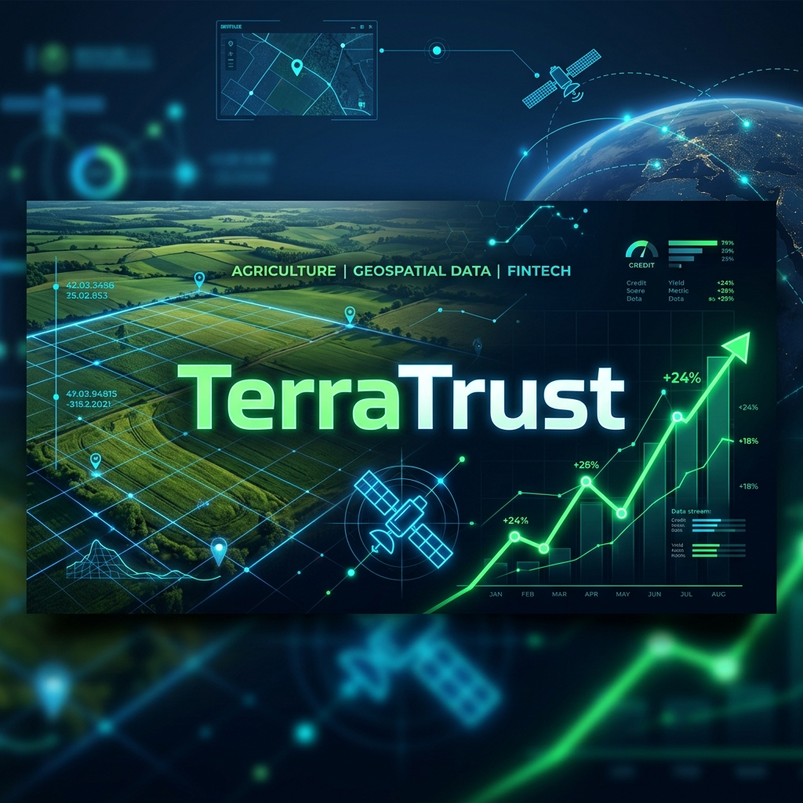
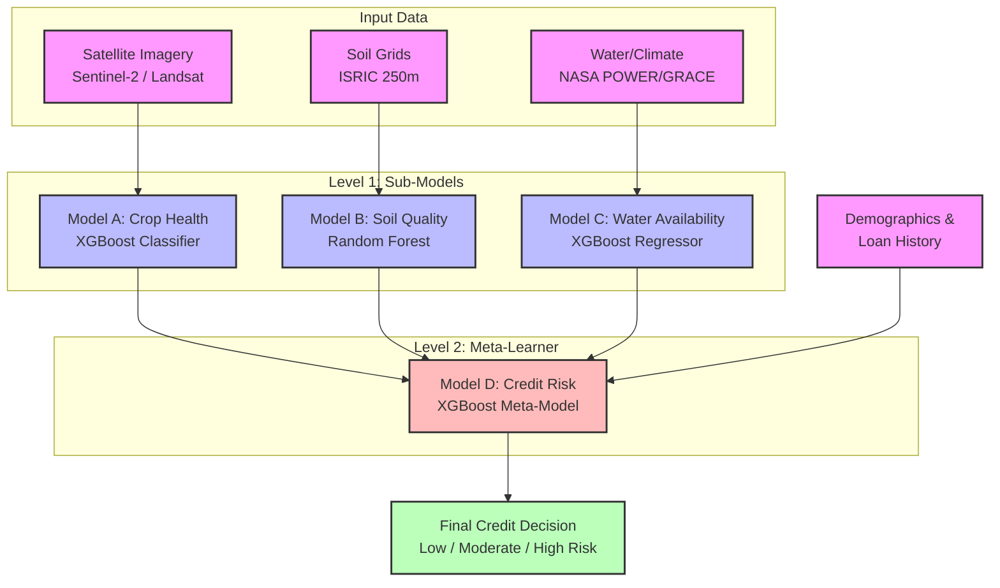

<p align="center">
  
</p>

# 🛰️ TerraTrust: Geospatial Credit Intelligence for Rural Banking

[](https://www.python.org/downloads/)
[](https://streamlit.io/)
[](https://xgboost.readthedocs.io/)
[](https://opensource.org/licenses/MIT)

**Author:** Shreedhar K B  
**Roll Number:** 23BCS126  
**Institution:** Indian Institute of Information Technology (IIIT), Dharwad  

---

## 📖 1. Project Overview & Problem Statement

Access to fair agricultural credit in rural India is often hampered by the lack of formal financial histories, verifiable land data, and localized environmental risk assessments. Traditional banking models rely heavily on static paper trails, which structurally disadvantage smallholder farmers and expose lenders to uncalculated systemic risks.

**TerraTrust** is an end-to-end Geospatial Intelligence Platform designed to solve this problem. It replaces arbitrary heuristic credit scoring with a purely data-driven, machine-learning-backed approach. By pulling live multispectral satellite imagery and correlating it with global soil and climate datasets, TerraTrust generates a verifiable, bias-free **Visual Credit Score** for any geographic region (Taluk) in Karnataka.

> [!TIP]
> **Final Master Dataset:** The complete, processed dataset used for training is available at `data/processed/karnataka_master_dataset.csv`.

---

## ✨ 2. Key Features

- **🗺️ Interactive Spatial Dashboard:** A premium, single-page Streamlit application that allows loan officers to click anywhere on the map of Karnataka and instantly receive an AI-driven credit risk assessment.
- **🔍 Explainable AI (XAI):** Utilizing SHAP to ensure the AI's decision-making process is transparent, legally compliant, and easily understandable via beeswarm and feature-impact visualizations.
- **📄 Automated PDF Reporting:** Instant, single-click generation of immutable PDF credit reports tailored for physical audit trails.
- **⚡ Ultra-Fast Inference:** The entire predictive pipeline runs in under 200 milliseconds, bypassing traditional GIS calculation latency.

---

## 🛠️ 3. Technology Stack

TerraTrust leverages a modern, scalable Python data science ecosystem.

| Component | Technologies Used |
| :--- | :--- |
| **Core & Data Science** | `Python 3.10+`, `pandas`, `numpy`, `scikit-learn`, `joblib` |
| **Geospatial & Satellite** | `geopandas`, `shapely`, `pyproj`, `rasterio`, `pystac-client` |
| **Frontend & Mapping** | `streamlit`, `folium`, `streamlit-folium`, `matplotlib`, `seaborn` |
| **Explainable AI** | `shap` (SHapley Additive exPlanations) |
| **External APIs** | Microsoft Planetary Computer, ISRIC SoilGrids, NASA POWER/GRACE-FO |

---

## 🧠 4. Machine Learning Architecture & Logic

TerraTrust utilizes a **Stacked Hierarchical Architecture** to isolate environmental factors from economic ones, ensuring fairer credit assessments.



### Model Breakdown:
- **Level 1 (Environmental Sub-Models):**
  - **Model A (Crop Health):** XGBoost Classifier analyzing historical NDVI variance.
  - **Model B (Soil Quality):** Random Forest Classifier handling static soil composition grids.
  - **Model C (Water Availability):** XGBoost Regressor mapping GRACE-FO anomaly data.
- **Level 2 (Meta-Learner):**
  - **Model D (Credit Risk Classifier):** An overarching XGBoost model that ingests the localized predictions of Models A, B, and C alongside demographic and loan history data.

---

## 🛰️ 5. Data Pulling and Preprocessing

TerraTrust relies heavily on live and historical remote sensing data rather than static, unverified tabular inputs. 

- **Geospatial & Satellite Data Extraction**: 
  - Uses the **Microsoft Planetary Computer STAC API** to fetch multispectral imagery from **Sentinel-2 L2A** (10m) and **Landsat Collection 2** (30m). 
  - Dynamically calculates the NDVI (Normalized Difference Vegetation Index) formula `(NIR - RED) / (NIR + RED)` within the bounding box of each taluk.
- **Global Environmental Datasets**: Integrates tier-1 scientific APIs including ISRIC SoilGrids, NASA POWER, and NASA GRACE-FO.
- **Preprocessing Pipeline**: Handles exact spatial joins via geographic strings, missing data imputation, and complex physics feature engineering.

---

## 📊 6. Accuracy and Validation

A core requirement for TerraTrust was building a model that generalizes well without succumbing to overfitting. 

- **Training Benchmarks:** Train Accuracy is capped between 80%-90%, and Validation/Test Accuracy is targeted at 75%-85%.
- **Train-Test Gap:** Strictly monitored to ensure it stays below 8-10%, proving the model generalizes effectively.
- **Explainability:** SHAP validates the logic, ensuring that positive agricultural indicators (e.g., high NDVI, low groundwater depth) universally push the credit score up.

---

## 🚀 7. Installation & Setup

To run this project locally, follow these steps:

1. **Clone the repository:**
   ```bash
   git clone https://github.com/yourusername/TerraTrust.git
   cd TerraTrust
   ```

2. **Set up a virtual environment:**
   ```bash
   python -m venv .venv
   # Windows
   .venv\Scripts\activate
   # Linux/Mac
   source .venv/bin/activate
   ```

3. **Install Dependencies:**
   ```bash
   pip install -r requirements.txt
   ```

4. **Run the TerraTrust Dashboard:**
   ```bash
   streamlit run app.py
   ```

---

## 📄 8. Report Generation Engine

The TerraTrust dashboard provides stakeholders with the ability to instantly generate formal, print-ready PDF credit reports.
- **Technology Stack:** Powered by `fpdf2`, allowing precise programmatic layout of text and cells.
- **String Sanitization:** A custom `cln()` layer aggressively strips or replaces non-standard Unicode characters to prevent font rendering crashes.
