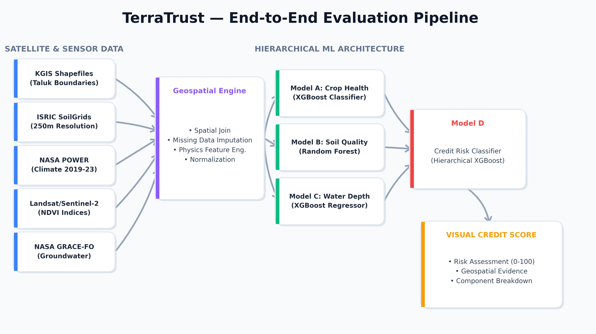

# 🛰️ TerraTrust: Geospatial Credit Intelligence for Rural Banking

[](https://www.python.org/downloads/)
[](https://streamlit.io/)
[](https://xgboost.readthedocs.io/)
[](https://opensource.org/licenses/MIT)

Shreedhar K B  
23BCS126  
ML Course Project  
Indian Institute of Information Technology (IIIT), Dharwad


---

## 📌 Overview

Access to fair agricultural credit in rural India is limited by sparse financial history, weak land documentation, and missing localized environmental risk assessments. Traditional lending pipelines struggle to verify risk for smallholder farmers, leading to both exclusion and systemic exposure.

**TerraTrust** is an end-to-end geospatial intelligence platform that replaces heuristic credit scoring with a machine-learning-driven **Visual Credit Score**. It fuses multispectral satellite imagery with global soil and climate datasets to produce transparent, verifiable risk assessments at the taluk level in Karnataka.

> [!TIP]
> **Master Dataset:** data/processed/karnataka_master_dataset.csv

---

## ✨ Key Features

- **🗺️ Interactive Geo-Dashboard:** Streamlit app for map-first credit assessment at taluk granularity.
- **🔍 Explainable AI (XAI):** SHAP-based interpretations for legally compliant, human-auditable decisions.
- **📄 Automated PDF Reports:** One-click export of printable credit reports for field audits.
- **⚡ Fast Inference:** End-to-end prediction in under 200 ms for real-time decision support.

---

## 🧠 Machine Learning Architecture

TerraTrust uses a **stacked hierarchical pipeline** that separates environmental signals from economic ones to reduce bias and improve robustness.



### Model Flow
- **Level 1 (Environmental Sub-Models)**
   - Crop Health: XGBoost classifier over NDVI variance
   - Soil Quality: Random Forest classifier over static soil grids
   - Water Availability: XGBoost regressor over GRACE-FO anomalies
- **Level 2 (Meta-Learner)**
   - Credit Risk: XGBoost classifier combining environmental predictions with demographic and loan signals

---

## 🛰️ Data Pipeline

- **Satellite Imagery:** Microsoft Planetary Computer STAC API, Sentinel-2 L2A (10 m), Landsat C2 (30 m)
- **Indexing:** NDVI computed as `(NIR - RED) / (NIR + RED)` per taluk
- **Environmental Sources:** ISRIC SoilGrids, NASA POWER, NASA GRACE-FO
- **Preprocessing:** Spatial joins, missing-value handling, and physics-based feature engineering

---

## 📊 Model Performance & Explainability

- **Targeted generalization:** Train accuracy capped at 80-90%, validation/test at 75-85%
- **Overfitting control:** Train-test gap constrained to under 8-10%
- **Interpretability:** SHAP summary plots confirm that agronomic signals drive score changes


---

## 🛠️ Tech Stack

| Component | Technologies |
| :--- | :--- |
| **Core & Data** | Python 3.10+, pandas, numpy, scikit-learn, joblib |
| **Geospatial** | geopandas, shapely, pyproj, rasterio, pystac-client |
| **Frontend** | streamlit, folium, streamlit-folium, matplotlib, seaborn |
| **Explainability** | shap |
| **External APIs** | Planetary Computer, SoilGrids, NASA POWER/GRACE-FO |

---

## 🚀 Quickstart

1. **Clone the repository**
    ```bash
    git clone https://github.com/yourusername/TerraTrust.git
    cd TerraTrust
    ```

2. **Create and activate a virtual environment**
    ```bash
    python -m venv .venv
    # Windows
    .venv\Scripts\activate
    # Linux/Mac
    source .venv/bin/activate
    ```

3. **Install dependencies**
    ```bash
    pip install -r requirements.txt
    ```

4. **Run the app**
    ```bash
    streamlit run app.py
    ```

---

## 🧪 Reproducibility

- **Build the master dataset**
   ```bash
   python -m src.build_master_dataset
   ```
- **Train models and generate metrics**
   ```bash
   python -m src.generate_all_results
   ```
- **Fetch real NDVI (optional)**
   ```bash
   python -m src.fetch_real_ndvi
   ```

---

## 📁 Repository Structure

```
.
├─ app.py
├─ src/
│  ├─ build_master_dataset.py
│  ├─ credit_scorer.py
│  ├─ fetch_real_ndvi.py
│  ├─ generate_all_results.py
│  ├─ llm_reporter.py
│  └─ models.py
├─ data/
│  ├─ raw/
│  ├─ processed/
│  └─ kgis_tabular/
├─ results/
└─ results_and_visualizations/
```

---

## 📄 Report Generation

The dashboard can export PDF credit reports built with `fpdf2`. A sanitization layer ensures robust font rendering for all fields.

---

## 📚 Documentation

- Project procedure and execution guide: Project_Procedure_and_Execution_Guide.md

---

## ✅ License

This project is licensed under the MIT License. See LICENSE for details.
